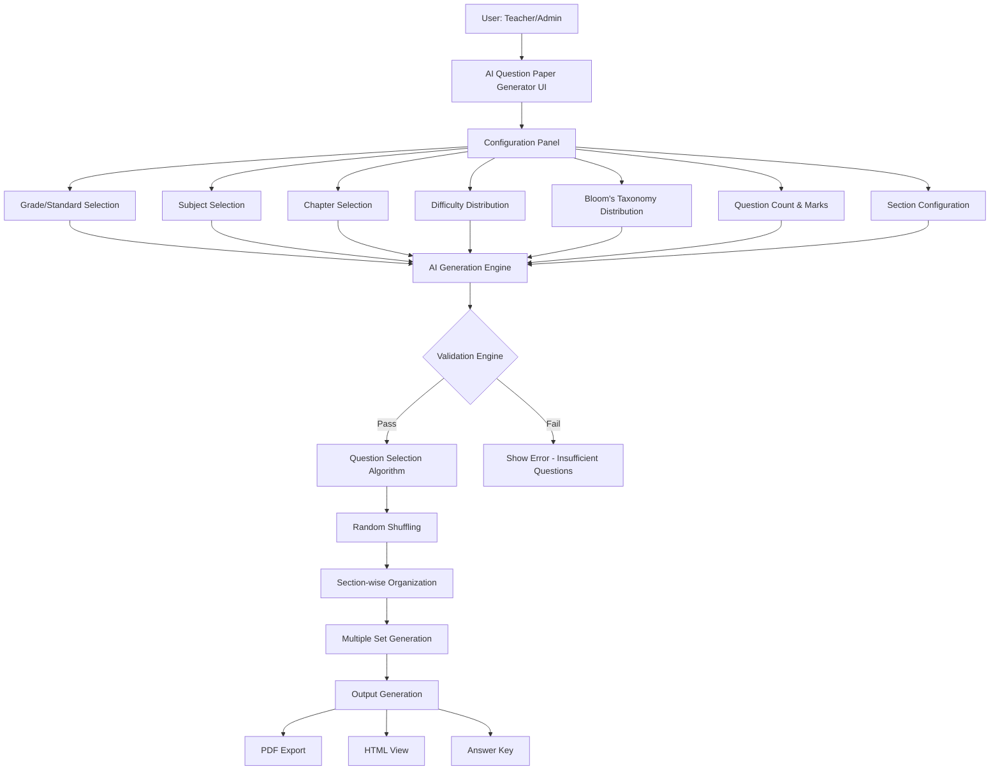

# Auto Question Paper Generator System - Implementation Plan

## Overview
Design and develop an Auto Question Paper Generator System that dynamically creates question papers by fetching questions from the database with intelligent distribution based on difficulty levels and Bloom's Taxonomy.

**Important Note**: The system will use the existing `lms_question_mapping` table to store difficulty levels and Bloom's Taxonomy mappings. No new columns need to be added to `lms_question_master` table.

## Data Structure Strategy

### Using Existing lms_question_mapping Table
The `lms_question_mapping` table already has:
- `questionmaster_id` - links to question
- `mapping_type_id` - the type of mapping (difficulty, taxonomy)
- `mapping_value_id` - the specific value

We will create mapping types in `lms_mapping_type`:
- **Difficulty Levels** (parent_id = 1): Easy, Medium, Hard
- **Bloom's Taxonomy** (parent_id = 2): Remember, Understand, Apply, Analyze, Evaluate, Create



## Implementation Steps

## Data Storage Approach

### Using Existing lms_question_mapping Table
```
lms_question_mapping table:
- questionmaster_id -> links to lms_question_master.id
- mapping_type_id -> references lms_mapping_type.id (1=Difficulty, 2=Bloom's)
- mapping_value_id -> references specific value (101=Easy, 102=Medium, etc.)
```

### Example Data
- Question has difficulty: mapping_type_id=1, mapping_value_id=101 (Easy)
- Question has taxonomy: mapping_type_id=2, mapping_value_id=203 (Apply)

## Implementation Steps

### Phase 1: Seed Data

#### 1.1 Seed lms_mapping_type table with default values
- **Difficulty Type** (parent_id = 1):
  - Easy (id: 101)
  - Medium (id: 102)
  - Hard (id: 103)
  
- **Bloom's Taxonomy Type** (parent_id = 2):
  - Remember (id: 201)
  - Understand (id: 202)
  - Apply (id: 203)
  - Analyze (id: 204)
  - Evaluate (id: 205)
  - Create (id: 206)

### Phase 2: Controller Methods

#### 2.1 New methods in questionpaperController.php
- `generateAIPaper(Request $request)` - Main AI generation logic
- `getAIQuestionPaperConfig(Request $request)` - Get configuration options
- `validateQuestionAvailability(Request $request)` - Check if sufficient questions exist
- `previewAIPaper(Request $request)` - Preview generated paper before saving
- `saveAIPaper(Request $request)` - Save generated paper to database

### Phase 3: Routes

#### 3.1 Add new routes in routes/lms.php
```
Route::get('generate_ai_questionpaper', [questionpaperController::class, 'generateAIPaper']);
Route::post('generate_ai_questionpaper', [questionpaperController::class, 'generateAIPaper']);
Route::post('ai_paper/validate_questions', [questionpaperController::class, 'validateQuestionAvailability']);
Route::post('ai_paper/preview', [questionpaperController::class, 'previewAIPaper']);
Route::post('ai_paper/save', [questionpaperController::class, 'saveAIPaper']);
```

### Phase 4: View - Generate AI Question Paper UI

#### 4.1 Create new view: resources/views/lms/generate_ai_questionpaper.blade.php
- **Step 1: Basic Configuration**
  - Grade/Standard dropdown
  - Subject dropdown
  - Academic Year
  
- **Step 2: Chapter Selection**
  - Multi-select chapter dropdown
  - Option: Select All Chapters
  
- **Step 3: Difficulty Distribution**
  - Easy: percentage slider (0-100%)
  - Medium: percentage slider (0-100%)
  - Hard: percentage slider (0-100%)
  - Auto-validation: Total must equal 100%
  
- **Step 4: Bloom's Taxonomy Distribution**
  - Multi-select taxonomy levels with percentage sliders
  - Default: Equal distribution
  
- **Step 5: Question Configuration**
  - Total number of questions (input)
  - Marks per question type or fixed marks
  - Total marks (auto-calculated, editable)
  
- **Step 6: Section Configuration**
  - Number of sections (1-5)
  - Section names (A, B, C...)
  - Questions per section
  - Marks per section
  
- **Step 7: Question Type Selection**
  - MCQ
  - Short Answer
  - Long Answer
  - Case-based
  - Fill in the blanks
  - Match the following

#### 4.2 Update show_questionpaper.blade.php
- Add "Generate AI Question Paper" button/link

### Phase 5: Algorithm Implementation

#### 5.1 Question Selection Algorithm
```
1. Fetch all questions matching filters (subject, standard, chapters)
2. Group questions by difficulty level and taxonomy
3. Calculate required counts based on percentages
4. Randomly select questions for each category
5. Ensure no duplicates across the paper
6. Validate total marks equals requirement
7. Shuffle within sections
8. Return generated question IDs
```

#### 5.2 Validation Logic
- Check if total difficulty percentages = 100%
- Check if total taxonomy percentages = 100%
- Check if available questions >= required for each category
- Check if total marks requirement can be met

### Phase 6: Advanced Features

#### 6.1 Multiple Set Generation
- Generate Set A, Set B, Set C simultaneously
- Each set uses different questions but follows same blueprint
- Parallel sets are non-overlapping

#### 6.2 Regeneration
- "Regenerate" button creates new random selection
- Maintains same configuration but different questions

#### 6.3 Export Options
- PDF export with proper formatting
- HTML view with printable format
- Separate answer key export

### Phase 7: UI/UX Features

#### 7.1 Real-time Validation
- Show available question count per difficulty/taxonomy
- Warning if insufficient questions
- Visual feedback on distribution

#### 7.2 Preview Mode
- Show generated paper before saving
- Allow manual reordering
- Allow removing/replacing questions

## Configuration Options Summary

| Feature | Options |
|---------|---------|
| Chapter Selection | Single, Multiple, All |
| Difficulty Levels | Easy/Medium/Hard with % |
| Bloom's Taxonomy | 6 levels with % |
| Question Count | 1-200 |
| Marks Distribution | Per question or fixed |
| Sections | 1-5 (A, B, C...) |
| Question Types | 6 types supported |
| Sets | 1-3 parallel sets |

## Output Format

### PDF/HTML Structure
```
[Exam Title]
[Instructions]
[Total Marks: X]

Section A [Y marks]
  Q1. Question text [Marks]
  Q2. Question text [Marks]
  ...

Section B [Y marks]
  ...
```

### Answer Key Format
```
Q1. Answer
Q2. Answer
...
```

## Database Schema Impact

### New Columns in lms_question_master
```php
$difficulty_level = null; // stores mapping_value_id (101, 102, 103)
$bloom_taxonomy = null; // stores mapping_value_id (201-206)
```

### New Fields in question_paper
```php
$ai_generated = 1; // flag for AI generated papers
$difficulty_distribution = '{"easy":30,"medium":50,"hard":20}';
$taxonomy_distribution = '{"remember":16,"understand":17,"apply":17,"analyze":17,"evaluate":16,"create":17}';
$sections_config = '[{"name":"A","questions":10,"marks":20},...]';
$generated_sets = 'SetA:1,2,3;SetB:4,5,6;SetC:7,8,9';